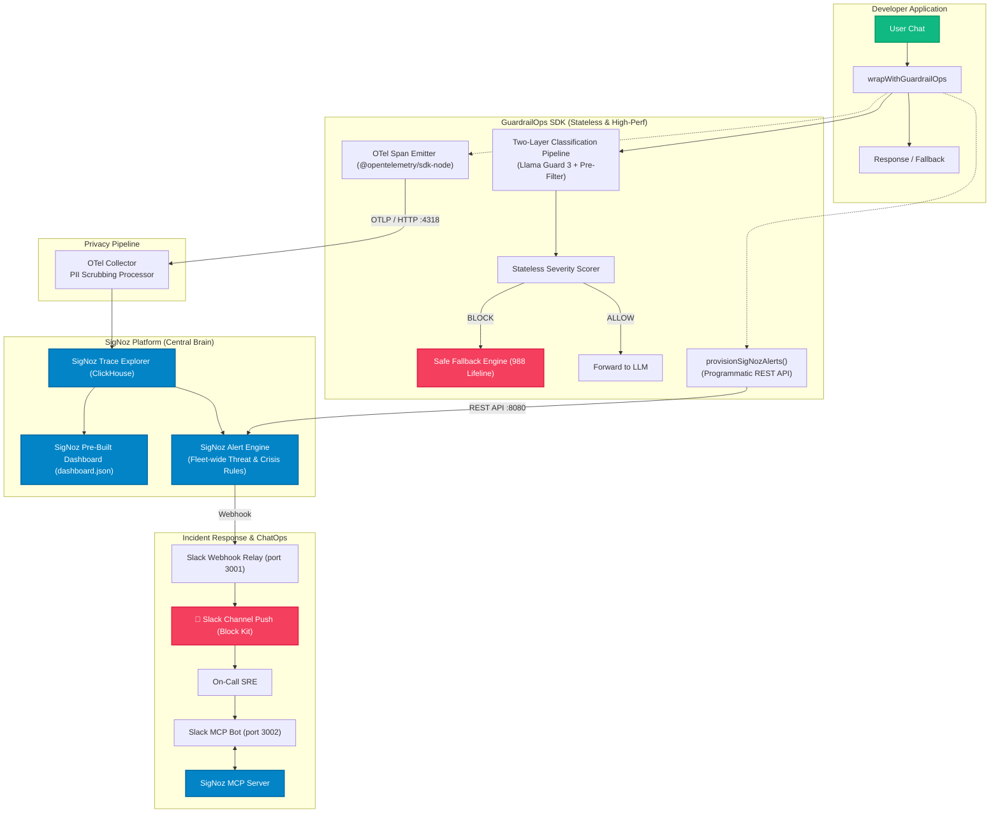

# 🛡️ GuardrailOps

> **SigNoz-native AI Safety & Incident Response for Node.js / TypeScript**

[](https://www.typescriptlang.org/)
[](./LICENSE)
[](https://www.wemakedevs.org/hackathons/signoz)
[](https://signoz.io)

GuardrailOps is a vendor-free, drop-in safety wrapper for LLM clients. It intercepts chat requests, classifies them across threat domains using **Meta Llama Guard 3** (local or cloud-hosted), blocks dangerous content with safe fallbacks, emits OpenTelemetry spans directly to **SigNoz**, and pushes real-time **Slack Block Kit alert cards** when critical incidents occur — all in **2 lines of code**.

---

## 📌 Table of Contents
- [Why GuardrailOps?](#why-guardrailops)
- [Quick Start](#quick-start)
- [SigNoz & OpenTelemetry (OTel) Integration](#signoz--opentelemetry-otel-integration)
- [Slack Push Alerts & Interactive Bot Guide](#-slack-push-alerts--interactive-bot-guide)
- [OpenTelemetry Span Attributes](#opentelemetry-span-attributes)
- [Project Structure & Foundry Deployment](#-project-structure)
- [Comparison with Existing Tools](#%EF%B8%8F-comparison-with-existing-tools)
- [AI Tool Disclosure (Hackathon Rule #7)](#ai-tool-disclosure)
- [Ethical Disclaimer](#ethical-disclaimer)

---

## Why GuardrailOps?

Existing guardrail tools (NeMo, LLM Guard, `@openai/guardrails`) check text and return scores. **None of them answer the question:**

> *"When your AI fails a vulnerable user at 3 AM, how do you know — and what do you do about it?"*

GuardrailOps closes that loop:

| Feature | Existing Guardrails | GuardrailOps |
|:--|:--|:--|
| **Crisis Action** | Return `{ flagged: true }` | **Block response + show 988 Crisis Lifeline + SigNoz Alert Engine pages SRE** |
| **Vulnerable Users** | Penalize all violations equally | **Protected Mental Health status (No threat penalties; immediate help dispatched)** |
| **Session State** | Stateful in application memory | **Stateless High-Performance SDK + SigNoz-native Fleet-Wide Alert Accumulation** |
| **Data Privacy** | Cloud API dependencies | **Local-First — Zero data leaves your infrastructure ($0 cost)** |
| **Telemetry** | None or adapter layers | **Native `guardrail.*` OTel spans to SigNoz with PII scrubbed at Collector** |
| **Incident Triage** | Manual log inspection | **Natural language trace querying via SigNoz MCP Server** |

---

## Quick Start

### Installation

```bash
npm install guardrailops
```

### Usage (2 Lines to Protect Any Chatbot)

```typescript
import { wrapWithGuardrailOps } from "guardrailops";
import { llmClient } from "./llm-client"; // Any OpenAI-compatible client (Ollama, vLLM, Groq, DeepSeek, etc.)

// Wrap your existing LLM client with local Meta Llama Guard 3 ($0 cost, 100% private)
const client = wrapWithGuardrailOps(llmClient, {
  domains: ["mental-health", "abuse", "jailbreak", "illegal"],
  classifier: "llama-guard", // Meta Llama Guard 3 via Ollama
  llamaGuard: {
    endpoint: "http://localhost:11434",
    model: "llama-guard3:1b",
  },
  otel: {
    serviceName: "my-chatbot",
    exporterEndpoint: "http://localhost:4318", // Stream spans to SigNoz
  },
});

// Your existing code works exactly as before
const response = await client.chat.completions.create({
  model: "my-llm-model",
  messages: [{ role: "user", content: userMessage }],
});
// If safe → normal LLM response
// If jailbreak → blocked, safe fallback returned, OTel span emitted to SigNoz
// If crisis → blocked, 988 Lifeline shown, on-call SRE paged on Slack
```

---

## 🚀 Step-by-Step Local Setup & Interactive Demo (No Paid Keys Needed!)

Follow these steps to run the complete stack locally (MindBot Demo App + SigNoz + OpenTelemetry + Llama Guard 3 + Slack Relay) with **$0 API fees**:

### 1. Prerequisites
- **Node.js**: v20+ installed
- **Docker**: Docker Desktop running (for SigNoz)
- **Ollama**: Installed locally ([ollama.com](https://ollama.com))

### 2. Pull Local Llama Guard 3
```bash
ollama pull llama-guard3:1b
ollama serve
```

### 3. Clone & Install
```bash
git clone https://github.com/tarunprajapati88/GuardrailOps.git
cd GuardrailOps
npm install
cp .env.example .env
```

### 4. Build TypeScript SDK
```bash
npm run build
```

### 5. Start Services (Docker Compose for Judges)

```bash
# Option A: Run complete stack via Docker Compose (Recommended for Judges!)
docker compose up -d

# Option B: Run services manually in separate terminals
npm run start:relay   # Start Webhook Relay (port 3001)
npm run start:demo    # Start MindBot Demo (port 3000)
npm run start:bot     # Start Slack MCP Bot (port 3002)
```

### 💡 How Users Get the SigNoz Dashboard
When a developer or team adopts GuardrailOps, they can set up the pre-built **AI Safety & Crisis Overview** dashboard in 2 ways:
1. **1-Click UI Import (Recommended):** Open SigNoz UI (`http://localhost:8080/dashboards`) -> Click **Import JSON** -> Paste `dashboard.json`.
2. **Programmatic API Seeding:** Run `npx tsx scripts/generate-dashboard.js` to automatically seed the dashboard directly into SigNoz's database.

### 6. Verify Local Demo & SigNoz Traces

1. **Open Demo App UI**: Navigate to **[http://localhost:3000](http://localhost:3000)** in your browser.
2. **Select Active User**:
   - `sarah.connor@acme.com` (Normal User — 0 Threats)
   - `hacker.jack@darkweb.org` (Attacker Simulation)
3. **Trigger Safety Violations**:
   - Click **Distress Demo**: Shows how companion mode allows general distress while observing the trace.
   - Click **Crisis Demo**: Shows immediate block + 988 Lifeline fallback + OTel span emitted to SigNoz.
   - Click **Jailbreak Demo** or **Abuse Demo**: Watch GuardrailOps intercept the prompt, return a safe refusal fallback, and stream OTel spans to SigNoz. SigNoz evaluates fleet-wide trace counts per user and triggers Slack alerts via its Alert Engine!
4. **View Spans & Configure Alert Rules in SigNoz UI**:
   - Open SigNoz UI at **[http://localhost:8080](http://localhost:8080)**.
   - Go to **Traces** → Filter by Service Name: **`guardrailops-demo`**.
   - Inspect live OpenTelemetry spans with `guardrail.domain`, `guardrail.action`, `guardrail.user.id`, and `guardrail.classifier.latency_ms`!

---

## 📲 Real-Time Slack Push Alerts & Slack MCP Bot Setup

GuardrailOps includes built-in Slack incident response for on-call SRE teams:

### A. 💬 Slack Incoming Webhooks (Real-Time Incident Push Cards)

1. Create a Slack App at **[api.slack.com/apps](https://api.slack.com/apps)** → Click **Create New App** (From Scratch).
2. Select **Incoming Webhooks** → Toggle **Activate Incoming Webhooks** to `ON`.
3. Click **Add New Webhook to Workspace** → Choose your `#alerts` or `#security` channel.
4. Add your webhook URL to `.env`:
   ```env
   SLACK_WEBHOOK_URL=https://hooks.slack.com/services/YOUR/SLACK/WEBHOOK_URL
   ```
5. Launch the Relay:
   ```bash
   npm run start:relay
   ```
6. When a safety violation or crisis occurs, GuardrailOps formats a **Slack Block Kit Card** and posts it directly to your channel!

### B. 🤖 Slack MCP Bot (Natural Language Trace Triage)

1. Start the Slack MCP Bot server (`slack-bot/bot.ts`):
   ```bash
   npm run start:bot
   ```
2. On-call SREs can ask questions directly in Slack:
   - `@GuardrailOpsBot show trace for session sess_demo_100`
   - `@GuardrailOpsBot 24h crisis summary`
   - `@GuardrailOpsBot check user usr_sha256_e3b0c442`

---

## 📊 SigNoz & OpenTelemetry (OTel) Integration

GuardrailOps is purpose-built to leverage the **OpenTelemetry (OTel)** standard and **SigNoz Observability Platform**:



### 5 Layers of SigNoz Integration

| Layer | SigNoz Feature | GuardrailOps Implementation |
|:--|:--|:--|
| **1. Traces** | **Trace Explorer** | Every LLM request emits 1 standard OTel span with rich `guardrail.*` semantic attributes to `http://localhost:4318/v1/traces`. |
| **2. Metrics** | **Metrics & Latency** | Derived automatically from trace spans: threat domain rate, block %, classifier latency. |
| **3. Dashboards**| **Pre-Built Panels** | Import `dashboard.json` into SigNoz for 1-click visualization of jailbreak spikes, threat score trends, and crisis events. |
| **4. Alerts** | **SigNoz Alert Engine** | SigNoz continuously evaluates ClickHouse trace data for threshold breaches (e.g., >3 blocked requests/5 min per user or CRITICAL crisis) and fires webhooks directly to the Slack Incident Relay. |
| **5. Triage** | **SigNoz MCP Server** | SREs query live SigNoz trace data via natural language in Slack using the integrated Model Context Protocol (MCP) framework. |

---

## 💬 Slack Push Alerts & Interactive Bot Guide

GuardrailOps features two distinct Slack integrations:

### 1. Real-Time Push Alert Cards (0.5s Webhook Relay)
* **What it does:** Automatically posts rich Slack Block Kit alert cards whenever an acute Crisis or severe threat block is triggered.
* **Setup (100% Free):**
  1. Open Slack -> Create an Incoming Webhook URL for your `#alerts` channel.
  2. Add `SLACK_WEBHOOK_URL=https://hooks.slack.com/services/YOUR/WEBHOOK/URL` to your `.env` file.
  3. Start the relay: `npm run start:relay`.

---

### 2. Interactive `@GuardrailOpsBot` Slack Triage (Free Local Tunnel)
* **What it does:** Allows engineers to `@mention` `@GuardrailOpsBot` in Slack to ask natural language forensic queries about session IDs or daily crisis summaries powered by SigNoz API / Model Context Protocol (MCP).
* **Setup (100% Free):**
  1. **Start Bot:** Run `npm run start:bot` (listens on port `3002`).
  2. **Expose Localhost:** In a new terminal, run `npx localtunnel --port 3002` (generates `https://<random-id>.loca.lt`).
  3. **Configure Slack App:** Go to **[api.slack.com/apps](https://api.slack.com/apps)** -> Click your App -> **Event Subscriptions** -> Enable Events.
  4. **Paste Request URL:** Enter `https://<random-id>.loca.lt/slack/events` -> Click **Save Changes**.

#### Supported Slack Queries:
* `@GuardrailOpsBot show trace for session sess_ms1umloe_7fw5ma` — Retrieves session trace metrics, threat category, block status, and direct SigNoz ClickHouse trace links.
* `@GuardrailOpsBot summary of today` — Returns 24-hour fleet block rate %, total trace count, and critical incident stats.

### OpenTelemetry Span Attributes

GuardrailOps tags every span using OpenTelemetry GenAI Semantic Conventions:

```ini
gen_ai.system                    = "guardrailops"
gen_ai.request.model             = "llama-guard3:1b"
guardrail.triggered              = true
guardrail.action                 = "BLOCKED"
guardrail.domain                 = "illegal"
guardrail.category               = "violent_crimes"
guardrail.crisis.severity        = "CRITICAL"
guardrail.push_alert             = true
guardrail.classifier             = "llama-guard"
guardrail.classifier.latency_ms  = 480
guardrail.response_blocked       = true
guardrail.fallback_shown         = true
guardrail.user.id                = "usr_sha256_e3b0c442"
guardrail.session_id             = "sess_demo_100"
```

### PII Redaction & Data Privacy
The OTel Collector configuration (`otel-collector-config.yaml`) runs an `attributes` deletion processor that strips `gen_ai.input.messages` and `gen_ai.output.messages` **before** writing spans to ClickHouse. User identifiers are hashed before telemetry export. **Raw prompt text never leaves application memory.**

#### What GuardrailOps Observes (Classification Metadata)
GuardrailOps is **classification middleware**. We observe **our own decisions**, not the user's content.

```ini
✅ guardrail.domain        = "jailbreak"
✅ guardrail.action        = "BLOCKED"
✅ guardrail.classifier    = "heuristic-prefilter"
✅ guardrail.user.id       = "usr_sha256_e3b0c442"
✅ guardrail.user.status   = "RESTRICTED"
```

#### What GuardrailOps NEVER Stores or Exports
❌ The user's actual message text
❌ The LLM's response content
❌ Chat history or conversation context
❌ Raw user identifiers (email, name, IP)

### GDPR Compliance APIs (Art. 17 & Art. 5)
For developers in the EU or handling health data, GuardrailOps exposes explicit privacy APIs:

```typescript
import { clearUser, setThreatTTL } from "guardrailops";

// GDPR Art. 17: Right to be forgotten
clearUser("user-123");  // Purges all threat state for this user

// GDPR Art. 5: Data minimization (threat scores decay after TTL)
setThreatTTL(24 * 60 * 60 * 1000); // 24 hours
```

---

## ⚙️ Two-Layer Classification Architecture

GuardrailOps uses a high-performance **Two-Layer Architecture**:

| Layer | Engine | Covers | Canonical Latency | Tradeoff / Privacy |
|:--|:--|:--|:--|:--|
| **Layer 1: Primary ML Classifier** | **Meta Llama Guard 3 (1B)** *(default)*, OpenAI Moderation, or Custom | 13 MLCommons safety categories (S1–S13: Mental health, abuse, weapons, CSAM, hate) | **~480ms** | **$0.00 (Local-First / Zero External Data Leakage)** |
| **Layer 2: Fast-Path Pre-Filter** | **Heuristic Regex Safety Net** | Immediate DAN/persona hijack short-circuits, base64 encoding attacks, fallback safety net | **< 1ms** | **$0.00 (Zero-Latency Short-Circuit)** |

> **Privacy vs. Latency Tradeoff**: Local Llama Guard 3 introduces a ~10x latency cost (~480ms vs ~45ms for cloud OpenAI Moderation). This is an explicit architectural trade-off favoring **100% data privacy and zero API costs** over cloud network latency.

### Taxonomy Mapping (MLCommons S1–S13 + Regex)

GuardrailOps maps Llama Guard 3's 1B MLCommons taxonomy (S1–S13) and Layer 2 Regex into 5 developer-friendly UX domain aliases:

| Safety Category / Engine | GuardrailOps Domain Alias | Default Action |
|:--|:--|:--|
| **S11** (Suicide & Self-Harm) | `mental-health` | BLOCK + 988 Lifeline + Page SRE (+0 threat pts) |
| **S5** (Defamation), **S7** (Privacy), **S10** (Hate), **S12** (Sexual) | `abuse` | BLOCK + Flag User (+10 pts) |
| **S1** (Violent), **S2** (Non-Violent), **S3** (Sex), **S4** (CSAM), **S9** (CBRN) | `illegal` | BLOCK + Flag User + Push Alert (+25 pts) |
| **Layer 2 Regex** (DAN Prompts / Roleplay Hijack) | `jailbreak` | BLOCK + Flag User + Push Alert (+15 pts) |
| **S6** (Specialized Advice), **S8** (IP), **S13** (Elections) | `off-topic` | BLOCK (+5 pts) |

---

## 🛡️ Threat Domains & Stateful User Scoring

### 🧠 Mental Health (Protected Users — Core Architectural Decision)

| Trigger | Action | Threat Points Added | User Flagged? |
|:--|:--|:--|:--|
| *"I don't want to be here anymore"* | BLOCK + 988 Lifeline fallback + push Slack alert | **+0 pts** | **❌ Never** |

> **Design Decision**: Mental health users in crisis are **protected, not penalized**. They receive 0 threat points so their account status is never restricted or blocked. The Slack alert brings immediate human outreach, not punishment.

### Stateful User Threat Accumulator
Repeat offenders are tracked across sessions with escalating consequences:

| Score | Status | What Happens |
|:--|:--|:--|
| 0 – 10 | 🟢 `NORMAL` | Standard monitoring |
| 11 – 30 | 🟡 `WATCH` | Elevated logging & trace tag |
| 31 – 60 | 🟠 `RESTRICTED` | Push alert forced on every violation |
| 61+ | 🔴 `BLOCKED` | All requests blocked + admin review alert |

---

## 📁 Project Structure

```
guardrailops/
├── src/                          # SDK source code (Stateless & High-Perf)
│   ├── index.ts                  # Public API exports
│   ├── wrapper.ts                # wrapWithGuardrailOps() proxy
│   ├── types.ts                  # TypeScript interfaces & enums
│   ├── domains.ts                # 5 domain default configs
│   ├── scorer.ts                 # Stateless severity scorer & push_alert logic
│   ├── blocker.ts                # Safe fallback generator (988 Lifeline support)
│   ├── signoz-alerts.ts          # Programmatic SigNoz Alert Provisioner (REST API)
│   ├── telemetry.ts              # OpenTelemetry span emitter to SigNoz
│   └── classifier/
│       ├── index.ts              # Two-layer classifier router
│       ├── llama-guard.ts        # Meta Llama Guard (Local Ollama & Cloud APIs)
│       ├── openai-moderation.ts  # OpenAI omni-moderation-latest
│       └── heuristic.ts          # Fast-path regex pre-filter
├── demo-app/                     # MindBot interactive demo UI
│   ├── server.ts                 # Express backend with Mock LLM
│   └── public/                   # Chat UI with live user identity selector
├── webhook-relay/                # SigNoz Alert → Slack Webhook Relay (server.ts)
├── slack-bot/                    # SigNoz MCP conversational bot for Slack (bot.ts)
├── scripts/
│   ├── attack-simulate.ts        # Chaos testing script
│   └── generate-dashboard.js     # SigNoz dashboard generator & seeder script
├── dashboard.json                # Pre-built SigNoz dashboard schema (v3)
├── otel-collector-config.yaml    # PII scrubbing config
├── casting.yaml                  # Foundry deployment manifest (SigNoz hackathon track)
├── casting.yaml.lock             # Foundry deployment lock file
├── docker-compose.yml            # Full stack docker setup for judges
└── .env.example                  # Environment template
```

> 💡 **Foundry Deployment Note:** `casting.yaml` and `casting.yaml.lock` are the official deployment manifests used by **Foundry** (`foundryctl cast -f casting.yaml`) to automatically provision SigNoz, its MCP Server, and the GuardrailOps stack in 1 step for hackathon evaluation.

---

## ⚖️ Comparison with Existing Tools

| Feature | NeMo Guardrails | Guardrails AI | `@openai/guardrails` | **GuardrailOps** |
|:--|:--|:--|:--|:--|
| **Language** | Python only | Python only | TypeScript | **TypeScript / Node.js Native** |
| **Classifier Backends** | Hardcoded | Custom/Ollama | OpenAI only | **Pluggable (Llama Guard / NVIDIA / OpenAI / Custom)** |
| **Data Privacy** | API dependent | Local option | Requires OpenAI | **100% Local-First (Zero external data leakage)** |
| **OpenTelemetry Spans** | Adapter | Native (Python) | ❌ None | **✅ Native OTel GenAI Spans to SigNoz (Node.js)** |
| **PII Scrubbing** | ❌ | In-memory | In-memory | **✅ Collector-level scrubbing + User Hashing** |
| **Session User Tracking** | ❌ | ❌ | ❌ | **✅ Stateful multi-turn threat scores** |
| **ChatOps Alerts** | ❌ | ❌ | ❌ (throws JS error) | **✅ Slack Block Kit push alerts** |
| **Protected Crisis User** | ❌ | ❌ | ❌ | **✅ 988 Lifeline + 0 threat pts for mental health** |
| **SigNoz Native** | ❌ | OTel generic | ❌ | **✅ 5-layer SigNoz integration + MCP bot** |

---

## AI Tool Disclosure

> As required by hackathon Rule #7: This project was developed with assistance from AI coding tools. All generated code was reviewed, tested, and modified by me as a solo developer. The architectural design, system integration decisions, and domain-specific safety logic are original work.

## Ethical Disclaimer

> ⚠️ GuardrailOps is a developer tool, NOT a medical device. It is not a replacement for professional mental health care and has not been clinically validated. Mental health users are **never flagged as threats** — they are protected users. The alert brings help, not punishment.

## License

MIT
